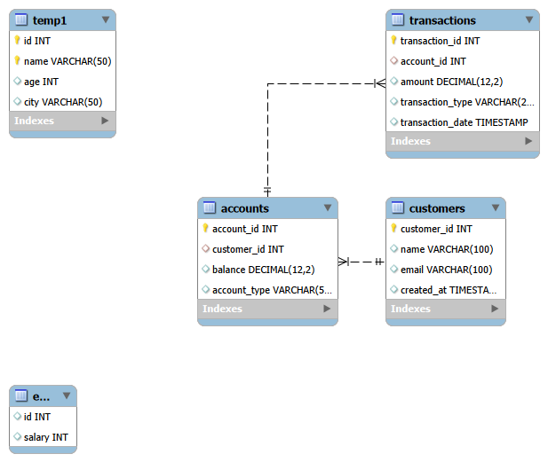

🏦 Banking Management System (MySQL)

📌 Description

This project is a relational database system designed to simulate a basic banking environment. It manages customers, their accounts, and transaction records such as deposits and withdrawals.

---

🧱 Features

- Customer management system
- Account creation and balance tracking
- Transaction handling (deposit & withdrawal)
- Automatic balance update using triggers
- Secure money transfer using transactions
- Stored procedures for fund transfer

---

🛠️ Technologies Used

- MySQL
- SQL (DDL, DML, DCL)

---

🗂️ Database Structure

🔹 Tables:

- customers → stores customer details
- accounts → stores account info and balance
- transactions → stores all transaction records

---

🔗 Relationships

- One customer can have multiple accounts
- One account can have multiple transactions

---

⚡ Advanced Features

- ✅ Trigger for auto-updating balance after transaction
- ✅ Stored procedure for transferring money
- ✅ Transaction control using COMMIT and ROLLBACK
- ✅ Data integrity using foreign keys

---

📊 Sample Queries

- Check account balance
- View transaction history
- Calculate total deposits
- Analyze account activity

---

🚀 How to Run

1. Import "schema.sql"
2. Run "data.sql"
3. Execute queries from "queries.sql"
4. Test stored procedures and triggers

---

🧩 ER Diagram

---

📷 Screenshots

![

---

📈 Future Improvements

- Add fraud detection system
- Implement minimum balance validation
- Add account status (active/inactive)
- Connect with frontend (web app)

---

👨‍💻 Author

Your Name-KHUSHI JAISWAL
